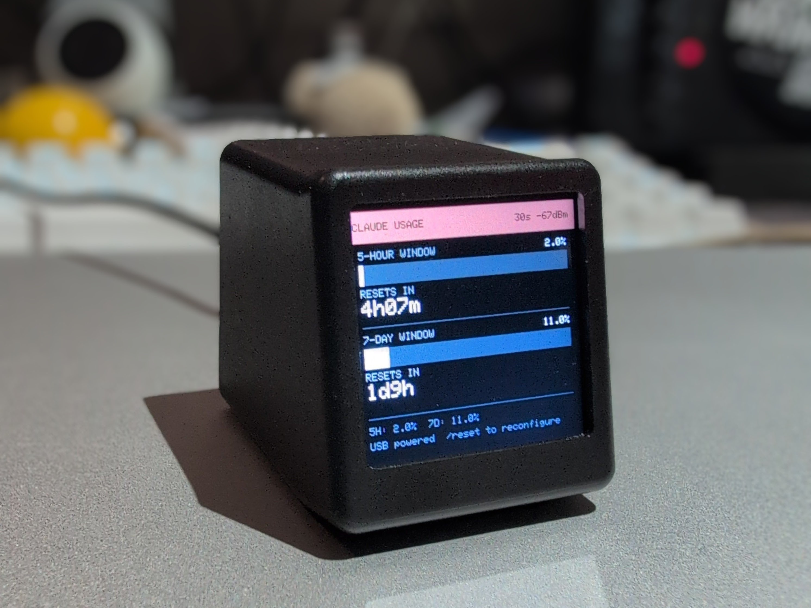
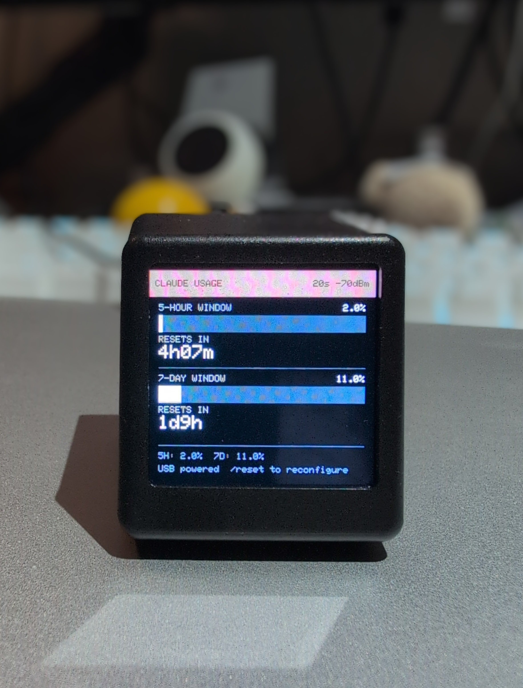

# Claude Usage Monitor — GeekMagic SmallTV Ultra

Real-time Claude Code rate-limit monitor for the **GeekMagic SmallTV Ultra** (ESP8266, 4 MB flash + ST7789 240×240 display).

Displays your 5-hour and 7-day usage windows with progress bars and reset countdowns, polling the Anthropic API on a configurable interval.

<p align="center">
  
  
</p>

## Attribution

Ported from [claude-usage-stick](https://github.com/oauramos/claude-usage-stick) by [@oauramos](https://github.com/oauramos), which targets ESP32-based devices (M5StickC Plus, M5StickC Plus2, LilyGo T-Display S3).

The API communication approach, captive portal design, and overall architecture come from the original project.

## Hardware

**GeekMagic SmallTV Ultra**
- ESP8266 (4 MB flash)
- ST7789 240×240 IPS display
- USB powered (no battery)
- No user buttons

## How It Works

1. Sends a minimal `max_tokens: 1` request to the Anthropic Messages API using your OAuth token
2. Reads `anthropic-ratelimit-unified-5h-utilization` and `anthropic-ratelimit-unified-7d-utilization` response headers
3. Displays usage bars and reset countdowns, refreshing on a configurable interval (30 s – 5 min)

The token is **AES-256-GCM encrypted** in EEPROM using a key derived from the device MAC address.

## Setup

### Prerequisites

- [PlatformIO CLI](https://platformio.org/install/cli)
- A Claude Code OAuth token — run `claude setup-token` in your terminal

### First flash (UART)

The SmallTV Ultra's USB port is power-only; first flash requires a 3.3 V UART programmer.

**Pinout** (pads on the ESP board):

| Pad | Signal |
|-----|--------|
| 1 (square) | GND |
| 2 | TXD0 → programmer RX |
| 3 | RXD0 → programmer TX |
| 4 | 3V3 (do not power from programmer — use USB) |
| 5 | GPIO0 → GND to enter flash mode |
| 6 | RST |

```bash
git clone https://github.com/jacobcapper/claudebox.git
cd claudebox
# Hold GPIO0 to GND, power cycle, then:
pio run -e smalltv-ultra -t upload
# Release GPIO0, power cycle
```

### Configure the device

On first boot the device creates an open WiFi AP named `ClaudeMonitor-XXXX`.

1. Connect to it (no password)
2. Open `http://192.168.4.1` in a browser
3. Enter your WiFi credentials and OAuth token
4. Hit **Save & Reboot**

### Future updates (OTA)

Once on your network, upload new firmware via the browser at:

```
http://<device-ip>/update
```

Or with curl:

```bash
curl -X POST http://<device-ip>/update \
  -F "firmware=@.pio/build/smalltv-ultra/firmware.bin"
```

### Factory reset

While the device is on your network:

```
http://<device-ip>/reset
```

This wipes EEPROM and reboots into setup AP mode.

## Key differences from the original

| | claude-usage-stick | This port |
|---|---|---|
| MCU | ESP32 | ESP8266 |
| Display | 240×135 or 320×170 | 240×240 |
| TLS | mbedTLS | BearSSL (`setInsecure`) |
| Crypto library | mbedTLS GCM | rweather/Crypto |
| Storage | NVS (Preferences) | EEPROM |
| Token security | PIN-derived AES key | MAC-derived AES key |
| Buttons | A + B | None |
| Web server | Setup portal only | Always-on (OTA + status + reset) |

## License

MIT — see [LICENSE](LICENSE).
